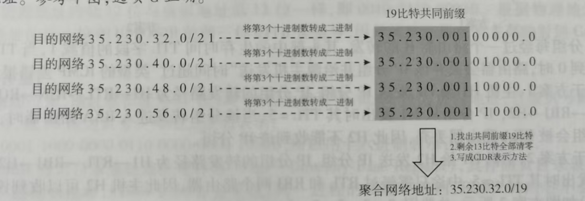

## PV大题做题思路及坑点注意

1、注意共享资源要加互斥变量

2、自己定义的信号量若有多个进程会同时需要访问，也要加互斥变量

3、检查自己的信号量有没有多余，可以某个资源是被某个进程独享的

4、注意一个读写原则，多个读进程可以不互斥，但写进程一定要与读进程互斥

##  (三) 数据链路层 → 3. 流量控制与可靠传输机制*坑点*

* 对于GBN分组确认时，一定要注意是按序接收的，若是此时收到的是**服务器传过来序号**为`1, 3`两个数据帧，那此时**客户端发送的数据帧的序号**就应该是`2`，因为要按序接收`2`还没有收到。

## 补码的减法运算

常规想法下，若**两数相减**，我们会需要对减数进行**取反+1**，将减法变成加法再进行计算，但是**重点就在这里**，**加法下**CF位看最高位的进位（这的确没错），但是若**原式是减法**，这时CF位就应该是对进位进行**取反**。

总结就是：

* 加法：CF=最高位进位
* 减法：CF=最高位进位取反

## 读题法

* 题目未明确说的前提条件，可以当作没有；
* 当有些选项需要某些前置条件才对且自己不确定是否是答案时，可以暂先把它当作可选，等全部选项看完后，若其它都是错的，那直接就选它，若还有其它可选项，再用其它方法排除；
* 排除前置条件，绝对错的直接定为错误选项，若可能是对的，再去找它需要的前置条件
* 还有一些默认的隐藏条件，自己积累好了；

## 何时进程阻塞

* **阻塞态（等待态）**＝进程主动放弃 CPU，去等一个**非 CPU 的事件**：比如等 I/O 完成、等信号量、等别的进程发消息。阻塞是从**运行态**变过去的。
* **关键一点：阻塞态只能从「运行态」进入。** 一个压根没拿到过 CPU 的进程，不可能直接变成阻塞态。所以 P 在就绪队列里干等，永远不可能是 "阻塞"。

## 进程调度的性能指标

* CPU利用率
$$
CPU利用率=CPU有效工作时间/（CPU有效工作时间+CPU空闲等待时间）
$$
* 系统吞吐量：表示单位时间内系统完成的作业数量；
* 周转时间
  * $周转时间=作业完成时间-作业开始时间$
  * $平均周转时间=（作业1的周转时间+···+作业n的周围时间）/n$
  * $带权周转时间=作业周转时间/作业实际运行时间$
  * $平均带权周转时间=（作业1的带权周转时间+···+作业n的带权周转时间）/n$
* 等待时间：等待时间是指进程在就绪队列中等待CPU的总时间。
* 响应时间：响应时间是指从用户提交到系统首次响应经过的那段时间。

## 时钟中断服务程序会更新哪些值

1. 系统时间与日期

   - 更新**系统时钟**：每次时钟中断把当前时间计数加 1（或按节拍累加）。
   - 维护**日时钟 / 实时时间**（时、分、秒、日期），供 `time()` 等系统调用和文件时间戳使用。

2. 进程调度相关（最重要考点）

   - **递减当前进程的时间片**：每来一次时钟中断，时间片计数减 1。
   - **时间片耗尽判断**：若时间片减为 0，则置一个 "需要调度" 标志（或直接触发进程切换），当前进程从运行态转入就绪态，调度器选择新进程。
   - 这是**时间片轮转（RR）调度**和**多级反馈队列**得以实现的基础。

3. 各类定时器（计时器管理）

   - 更新内核中的**软定时器 / 定时队列**，用于：
     - 进程**睡眠 / 延时**到期的唤醒（如 `sleep()`、`delay()`）。
     - **超时检测**（如网络重传超时、I/O 请求超时）。
   - 每节拍检查定时器链表，到期项从等待队列移出并唤醒对应进程。

4. 其他统计与辅助计数

   - **CPU 使用率统计**（用户态时间、内核态时间等）。
   - 某些实现中用于**刷新缓冲、记账**等辅助功能。

## 进程互斥的软硬件实现法

软件实现法：单标志法，双标志法，双标志后检查法，peterson方法

硬件实现法：中断屏蔽字，TestAndSet，Swap法

> 具体实现，问AI或者查书吧，内容太多了。

## 路由聚合

话不多说看图

## SMTP

SMTP本来就是为传送ASCII码而生

## 写组相联答案时的注意

在答案中，写组相联映射注意要写“几路组相联映射”，不能只写“组相联映射”。