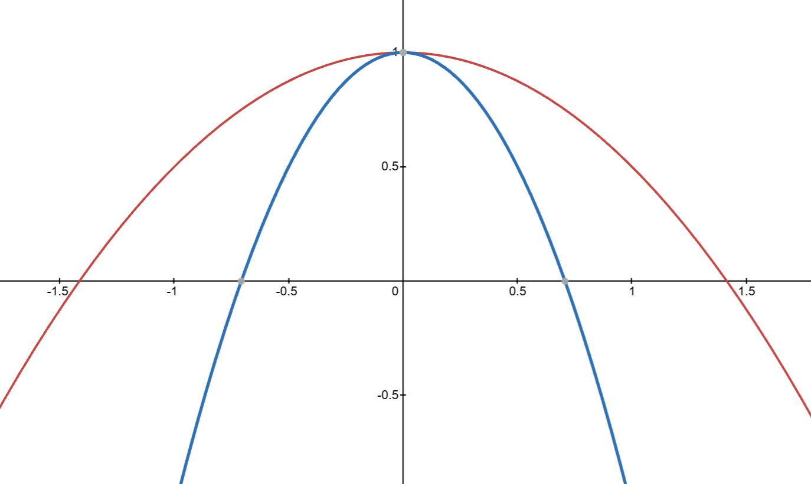

## 不定积分坑点

每次求完**不定积分**，不要忘记给原函数加一个**常数项**$C$。

若函数是**分段函数**，记得要考虑**连续性**，从而去确定**常数项**$C$的取值。

## 反常积分判定敛散性

1. 式子能化简先化简
2. 再使用定义法或者判定法去判断

## 曲率的理解

### 1. 直角坐标 $y = y(x)$
$$
K=\frac{|y''|}{\big(1+(y')^2\big)^{\frac{3}{2}}}
$$

### 2. 参数方程 $\begin{cases}x=\varphi(t)\\y=\psi(t)\end{cases}$
$$
K=\frac{|\varphi'(t)\psi''(t)-\varphi''(t)\psi'(t)|}{\Big[\big(\varphi'(t)\big)^2+\big(\psi'(t)\big)^2\Big]^{\frac{3}{2}}}
$$

### 3. 极坐标 $\rho=\rho(\theta)$
$$
K=\frac{|\rho^2+2(\rho')^2-\rho\rho''|}{\big(\rho^2+(\rho')^2\big)^{\frac{3}{2}}}
$$

### 曲率半径
$$
R=\frac1K
$$

### 曲率的几何含义

曲线的曲率表示曲线在某一切点处弯曲程度的数值。曲线的曲率越大，弯曲程度越大。

例如下方是$y=-0.5x^{2}+1$和$y=-2x^{2}+1$的图像.

* $y=-0.5x^{2}+1$的曲率是$\kappa = \frac{|y''|}{(1 + y'^2)^{3/2}} = \frac{1}{(1 + x^2)^{3/2}}$

* $y=-2x^{2}+1$的曲率是$\kappa = \frac{|y''|}{(1 + y'^2)^{3/2}} = \frac{4}{(1 + 16x^2)^{3/2}}$

## 微分方程解的性质

$$y' + P(x)y = 0 （*）$$

$$y' + P(x)y = Q(x)（**）$$

* 若有$y_1$和$y_2$是方程`*`的解，则$y_1$与$y_2$的线性组合也是`*`的解；

* 若有$y_1$和$y_2$是方程`**`的解，则$y_1-y_2$是`*`的解；

* 若有$y_1$和$y_2$是方程`**`的解，则$k_1y_1+k_2y_2$，当$k_1+k_2=0$时是`*`的解，当$k_1+k_2=1$时是`**`的解。

## 数学归纳法

1. 举实际例子看规律；
2. 假设规律为“巴拉巴拉”；
3. 代入验证假设，是否正确；
4. 最后归纳结论。

## 何为变化率

假设此时说点$P$的横坐标对时间的变化率为$v_0$，其实就是x关于t的导数，因此导数即变化率。

> 例子，2016年真题卷，填空题13题

## 注意定义域范围

所有定义域都要考虑，并且若有绝对值存在，还要情况讨论。

## 多元函数求极值

1. 对每个未知量进行求偏导；
2. 让每个偏导的隐函数为0，联立方程组求解；
3. 将解出来的值带回原方程确认其值；
4. 解出来的值都是驻点，不是极值点；
5. 需要将驻点一一代入原方程，确定最终的极值。

## 常见的几何函数

[link](/personal-website/notes/geometric-functions/)

## 一重积分与二重积分之间的转化

### 二重积分 → 累次积分
1. 直角坐标：选积分次序（X 型 / Y 型）
2. 极坐标：含 $x^2+y^2$ 或圆域时用，记得乘雅可比 $r$
3. 对称性 + 奇偶性简化计算

### 一重积分 → 二重积分（升维技巧）
1. 乘积升维：$\int_a^b f(x)\,dx \cdot \int_a^b g(x)\,dx = \iint_D f(x)g(y)\,dxdy$
2. 变量字母无关：$\int_a^b f(x)\,dx = \int_a^b f(y)\,dy$，配合轮换对称性
3. 不等式证明：平方/乘积凑成二重积分（如柯西-施瓦茨）

### 累次积分 → 一重积分
1. 交换积分次序
2. 变限积分升维后换序：$\int_a^b dx\int_a^x f(t)\,dt = \int_a^b f(t)(b-t)\,dt$

### 辅助工具
1. 轮换对称性：区域关于 $y=x$ 对称
2. 形心公式：$\iint_D x\,d\sigma = \bar{x}\cdot S_D$

## 结尾

未完，待续。。。