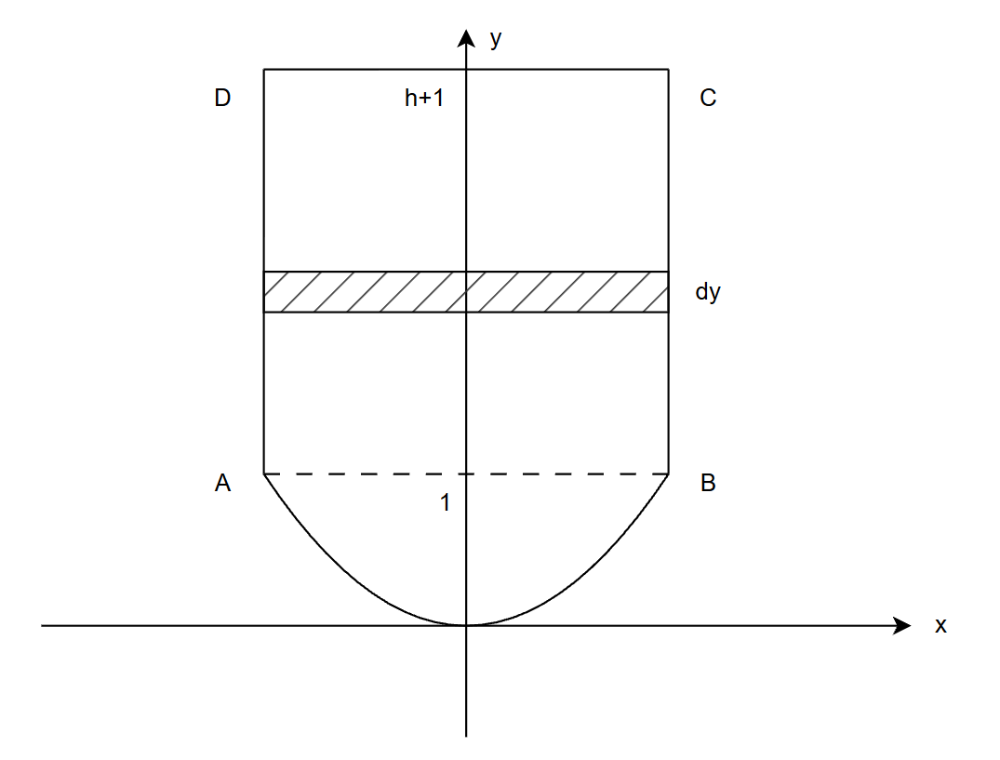
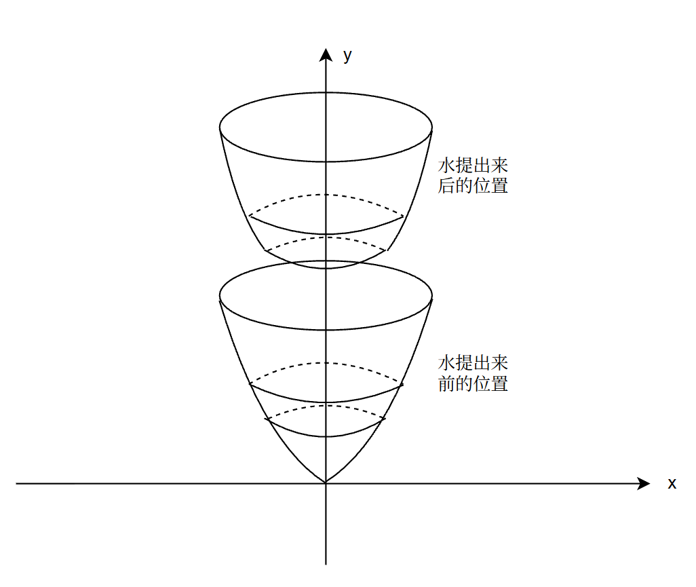
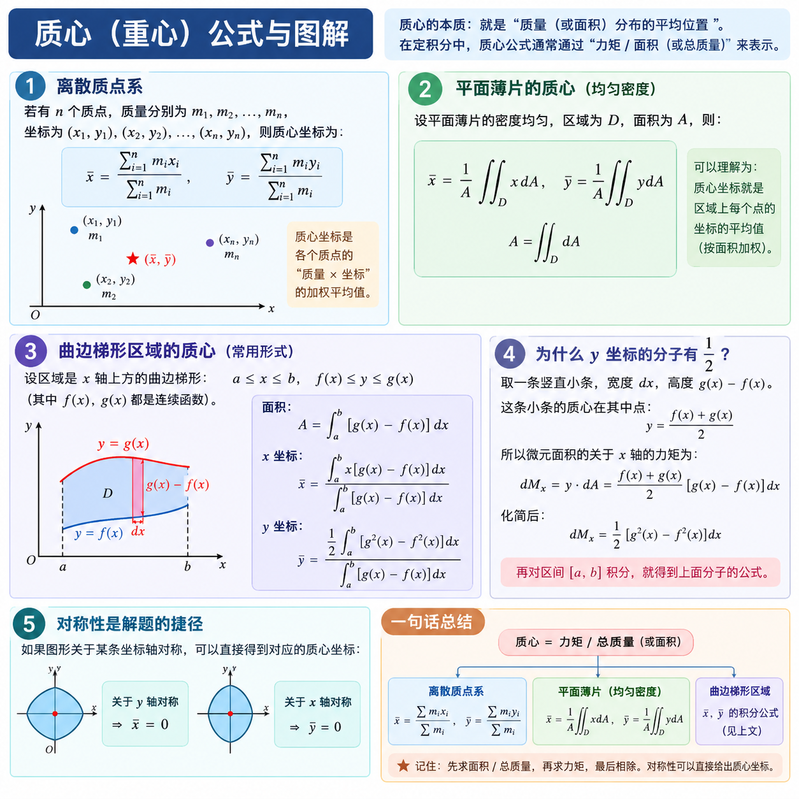

## 水压面积做功

定积分公式如下：

$$
W=\int_a^b p(x)A(x)\,dx
$$

其中$p(x)$水的压力：

$$
p(x)=\rho gh(x)
$$

水压做功=水压X受力面积所以：

$$
W=\int_a^b \rho gh(x)A(x)\,dx
$$

可使用下图来练习公式

> 例子，请翻看《武忠祥高数强化讲义》P146 例1

## 抽水做功公式

$$
W=\rho g\int_a^b A(x)h(x)\,dx
$$

其中：

$$
\rho：水的密度
$$

$$
g：重力加速度
$$

$$
A(x)：水在位置 x 处的水平截面积
$$

$$
h(x)：该薄层水需要提升的距离
$$

$$
dx：薄层水的厚度
$$

推导过程如下：

$$
dV=A(x)\,dx
$$

$$
dm=\rho A(x)\,dx
$$

$$
dF=\rho gA(x)\,dx
$$

$$
dW=dF\cdot h(x)
$$

$$
dW=\rho gA(x)h(x)\,dx
$$

$$
\boxed{
W=\rho g\int_a^b A(x)h(x)\,dx
}
$$

核心公式

$$
\boxed{
dW=(\text{这一层水的重量})
\times
(\text{这一层水需要提升的距离})
}
$$

$$
\boxed{
dW=\rho gA(x)h(x)\,dx
}
$$

可使用下图来练习公式

> 例子，请翻看《武忠祥高数强化讲义》P146 例2

## 万有引力公式

万有引力大小：

$$
F=\frac{Gm_1m_2}{r^2}
$$

物体沿运动方向移动时，若万有引力与运动方向的夹角为 $\theta$，则万有引力在运动方向上的分量为：

$$
F_{\parallel}=F\cos\theta
$$

微元功：

$$
dW=F\cos\theta\,ds
$$

因此变力做功：

$$
\boxed{
W=\int F\cos\theta\,ds
}
$$

若物体沿 $x$ 轴运动，则：

$$
ds=dx
$$

因此：

$$
\boxed{
W=\int F\cos\theta\,dx
}
$$

---

### 之前例题中的具体形式

当质点 $P$ 位于 $(x,0)$，质点 $Q$ 固定在 $(0,1)$ 时：

$$
r=\sqrt{x^2+1}
$$

因此：

$$
F=\frac{G}{x^2+1}
$$

设万有引力方向与 $x$ 轴正方向的夹角为 $\theta$，则：

$$
\cos\theta=\frac{x}{\sqrt{x^2+1}}
$$

所以引力在 $x$ 轴方向上的分量为：

$$
F_x
=
F\cos\theta
=
\frac{Gx}{(x^2+1)^{3/2}}
$$

质点 $P$ 从 $x=0$ 移动到 $x=l$，克服万有引力所做的功为：

$$
\boxed{
W=
G\int_0^l
\frac{x}{(x^2+1)^{3/2}}\,dx
}
$$

> 例子，请翻看《武忠祥高数强化讲义》P147 例3

## 质心公式

离散质点系：

$$
\boxed{
\bar{x}=
\frac{\sum_{i=1}^{n}m_ix_i}
{\sum_{i=1}^{n}m_i}
}
$$

$$
\boxed{
\bar{y}=
\frac{\sum_{i=1}^{n}m_iy_i}
{\sum_{i=1}^{n}m_i}
}
$$

连续质量分布：

$$
\boxed{
\bar{x}=
\frac{\int x\,dm}
{\int dm}
}
$$

$$
\boxed{
\bar{y}=
\frac{\int y\,dm}
{\int dm}
}
$$

均匀平面薄片：

$$
\boxed{
\bar{x}=
\frac{1}{A}\iint_D x\,dA
}
$$

$$
\boxed{
\bar{y}=
\frac{1}{A}\iint_D y\,dA
}
$$

$$
A=\iint_D dA
$$

一维细棒，线密度为 \(\rho(x)\)：

$$
\boxed{
\bar{x}=
\frac{\int_a^b x\rho(x)\,dx}
{\int_a^b \rho(x)\,dx}
}
$$

$$
M=\int_a^b\rho(x)\,dx
$$

你可以把质心的核心思想压缩成一句：

$$
\boxed{
\text{质心位置}
=
\frac{\text{质量矩}}
{\text{总质量}}
}
$$

> 例子，请翻看《武忠祥高数强化讲义》P147 例4